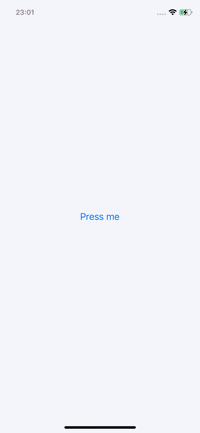

# BottomSheet

A Bottom Sheet component made in UIKit.



### To do:
- [x] Fix safe area layouts
- [x] Change BottomSheetView to draw the rounded layer rather than masking the content view

## Usage

### `BottomSheetViewController`
This controller uses `BottomSheetView` as its main view. To specify custom content for the bottom sheet create your own view, and assign it to the `contentView` variable of the controller. You can either do this by subclassing `BottomSheetViewController`, to implement your own business logic, or by assigning the view at initialisation before presenting the sheet.

#### Example: subclassing `BottomSheetViewController`

```swift
final class CustomBottomSheetViewController: BottomSheetViewController {
    override func loadView() {
        super.loadView()
        	
        let myView = UIView()
        myView.backgroundColor = .red
		
        contentView = myView
    }
}
```

#### Example: assignment on init

```swift
func presentBottomSheet() {
    let controller = BottomSheetViewController()
    controller.contentView = UIView()
    ...
}
```

### Presentation
Instantiate your `BottomSheetViewController` and set the presenting controller as the `transitioningDelegate` of the bottom sheet.

```swift
final class ViewController: UIViewController {
    ... 
    
    func presentBottomSheet() {
        let controller = BottomSheetViewController()
        controller.transitioningDelegate = self
        present(controller, animated: true, completion: nil)
    }
}

extension PresentingController: UIViewControllerTransitioningDelegate {
    func presentationController(forPresented presented: UIViewController, presenting: UIViewController?, source: UIViewController) -> UIPresentationController? {
        BottomSheetPresentationController(presentedViewController: presentedController, presenting: presenting)
    }
}
```
