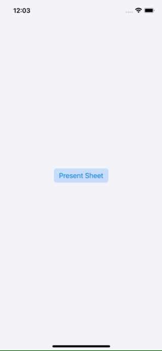

# BottomSheet

A Bottom Sheet component made in UIKit.



## Installation
### Swift Package Manager
#### Xcode Project
To add a package dependency to your Xcode project, select File > Swift Packages > Add Package Dependency and enter the repository URL:

 `https://github.com/gaetanomatonti/BottomSheet`
 
#### Swift Package

Edit your `Package.swift` file and add the repository URL to the  dependencies.

```swift
dependencies: [
    .package(url: "https://github.com/gaetanomatonti/BottomSheet", .upToNextMajor(from: "0.4.0"))
]
```

## Usage

### `SheetTransitioningDelegate`
Inside your view controller store a new instance of `SheetTransitioningDelegate`. When presenting a new view controller you should set its `modalPresentationStyle` to `.custom` and its `transitioningDelegate` to the `SheetTransitioningDelegate` you stored.

#### Example
```swift
func presentViewController() {
  let viewController = UIViewController()
  viewController.modalPresentationStyle = .custom
  viewController.transitioningDelegate = sheetTransitioningDelegate
  present(viewController, animated: true)
}
```